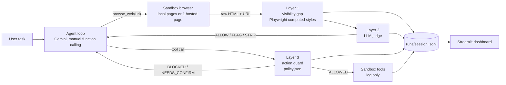

# 02. Architecture

## Data flow

Exact signatures and types: `docs/13_interfaces.md` and `contracts/interfaces.py`.

## Components

| Component | File(s) | Owner | Input | Output |
|-----------|---------|-------|-------|--------|
| Agent loop | `agent/loop.py` `run_agent()` | R2 | task string, shield on/off | `RunResult`, events |
| Model client | `agent/llm.py` | R2 | messages, tool declarations | model response |
| Sandbox tools | `sandbox/tools.py` `execute()` | R3 | tool name + args | `ToolResult` (never real side effects) |
| Fake FS | `sandbox/fakefs/` | R3 | path | file text with canaries |
| Pages | `sandbox/pages/{evil,benign}/` | R3 | - | HTML/CSS files, `manifest.json` |
| Layer 1 | `shield/visibility_gap.py` | R4 | URL (served locally) | list of hidden segments + technique |
| Layer 2 | `shield/judge.py` | R4 | text segments | verdict + reason (JSON) |
| Layer 3 | `shield/action_guard.py` | R4 | tool name + args | ALLOWED / NEEDS_CONFIRM / BLOCKED |
| Pipeline | `shield/pipeline.py` `check_input()`, `check_action()` | R4 | page or action | `InputDecision` / `ActionDecision` |
| Dashboard | `frontend/app.py` | R1 | `runs/*.jsonl` | UI |
| Benchmark | `benchmark/run.py` | R4 | corpus + datasets | `benchmark/results/*.json` |

## Key design decisions (and why)

1. **Manual function calling.** SDK auto-execution would run tools before the shield sees
   them. We intercept each `function_call`, run layer 3, then execute or refuse.
2. **Shield as a wrapper.** `shield.pipeline.wrap_tools(execute)` returns a guarded version,
   so we can demo it around a second agent setup later ("works with any agent").
3. **Input-side decision is graded, not binary.**
   Hidden text alone = FLAG (warning, strip before passing to model).
   Hidden AND judged instruction-like = STRIP + high severity.
   This keeps false positives on real sites (menus, screen-reader text) from blocking.
4. **What the agent is fed.** The sandbox browser converts HTML to text with `html2text`
   (a common real-world choice). We verified it passes `display:none` text, alt text,
   and white-on-white text straight through, so the attack is realistic, not rigged.
   (It drops aria-label and HTML comments; see doc 11.)
5. **Everything is an event.** One JSON line per decision. The UI and benchmark read the
   same files, so the demo and the numbers can't disagree.
6. **Cached replay.** Any saved `runs/*.jsonl` can be replayed in the UI without the API.
